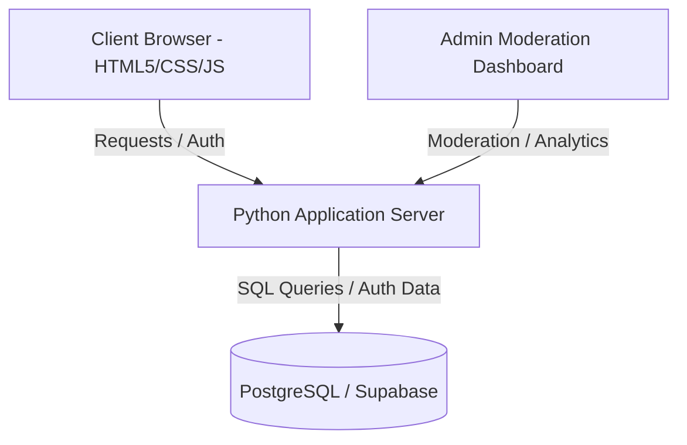

# 🟣 Northwestern Second-Hand Trading Platform

A localized, verified peer-to-peer re-commerce web application designed exclusively for the Northwestern University campus community.

---

## 📌 Project Overview

Northwestern University students frequently need an affordable way to buy and sell used textbooks, dorm furniture, electronics, and clothing. Public marketplaces like Facebook Marketplace, Craigslist, or eBay often present safety concerns, lack local relevance, and require meeting strangers off-campus.

This platform solves those challenges by providing a centralized, secure, and verified environment restricted entirely to verified Northwestern University community members.

---

## ✨ Core Features

### 👤 Student / End-User Features
* **Verified Access:** Authentication restricted to `@u.northwestern.edu` NetID emails to guarantee campus exclusivity.
* **AI-Assisted Listing Creation:** Upload item photos to automatically suggest pricing and product descriptions, with manual editing controls.
* **Campus-Focused Search & Filtering:** Filter listings by category, price range, item condition, and specific campus pickup locations (e.g., *North Campus*, *South Campus*, *Norris University Center*).
* **In-App Direct Messaging:** Secure buyer-seller communication and price offers without sharing personal phone numbers or social media handles.
* **Watchlist & Price Drop Alerts:** Save target listings to receive real-time updates when prices drop.

### 🛡️ Admin & Moderation Tools
* **User & Content Moderation:** Central panel for administrators to review flagged items, issue warnings, or ban users who violate community guidelines.
* **Report Queue:** Dedicated interface to process user reports regarding spam, scams, or harassment.
* **Dynamic Taxonomy:** Dynamic management of marketplace categories to adapt to seasonal needs (e.g., adding *Sublets* prior to summer).
* **Platform Analytics:** Real-time dashboards tracking active users, total listings, popular search terms, and completed transactions.

---

## 🛠️ Technology Stack & Architecture

* **Front-End:** HTML5, CSS3, JavaScript (ES6+) styled using Northwestern's institutional color palette (Deep Purple & White).
* **Back-End:** Python server handling core application routing, business logic, and authentication sessions.
* **Database & Realtime Messaging:** PostgreSQL / Supabase executing least-privilege queries for data persistence and real-time chat setup.



---

## 📂 Project Repository Structure

```text
Capstone Project/
├── index.html                # Main application interface & listing grid
├── style.css                 # Northwestern Deep Purple theme & layout styles
├── script.js                # Dynamic client-side logic & UI interactions
├── supabase_chat_setup.sql   # SQL schema for database tables & real-time messaging
└── context.md                # Project architecture & environment context
```

---

## 🚀 Getting Started

### Prerequisites
* A modern web browser (Chrome, Firefox, Safari, Edge)
* PostgreSQL or a Supabase project instance
* Python 3.8+

### Setup & Database Initialization

1. **Clone the Repository:**
   ```bash
   git clone https://github.com/your-username/northwestern-trading-platform.git
   cd "Capstone Project"
   ```

2. **Configure Database Schema:**
   Import and run the `supabase_chat_setup.sql` script in your PostgreSQL/Supabase SQL editor to create the necessary tables for users, listings, and chat channels.

3. **Launch the Application:**
   Open `index.html` in your browser or serve it through your local Python server environment.

---

## 👤 Author

* **Tom Wang** — Northwestern University Capstone Project
